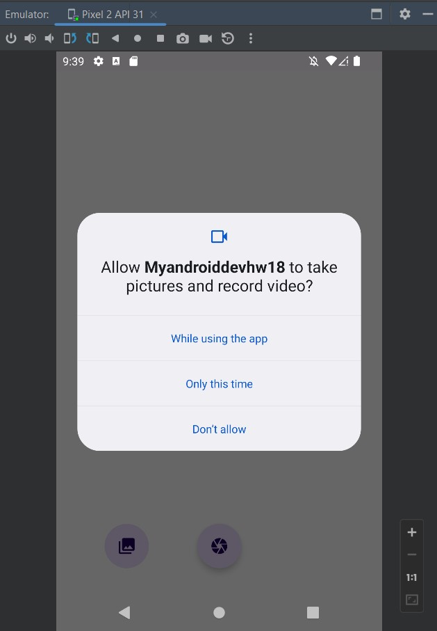
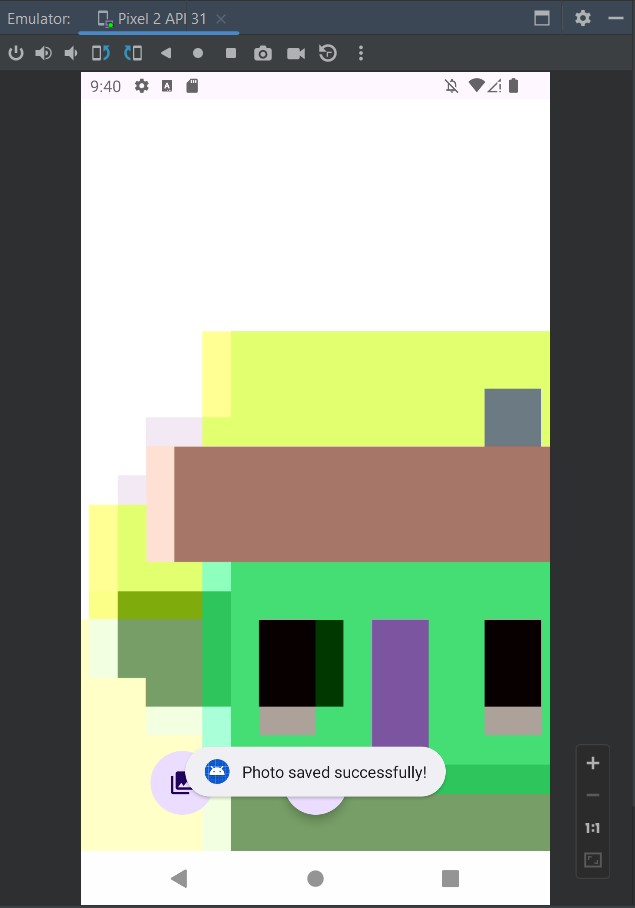
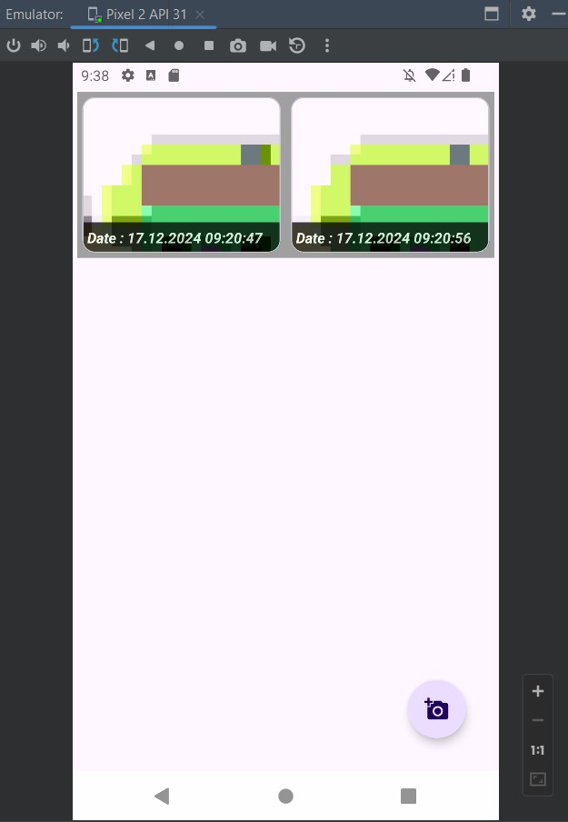
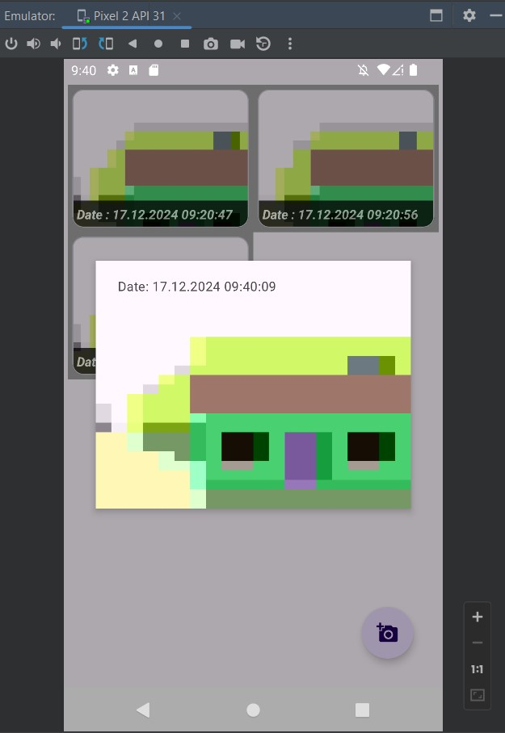

# Урок 18. Работа с защищёнными разделами ОС

### Цель практической работы:
Применить знания по Permissions и научиться работать с камерой.

### Что нужно сделать:
Вам предстоит написать мини-приложение «Достопримечательности». 
Приложение должно состоять из двух экранов: список фотографий и создание фотографии.

1. Создайте базу данных, используя Room.
2. Объявите в качестве модели сущность, содержащую путь до файла с фотографией и датой снимка.
3. Разместите на экране списка фотографий кнопку перехода на экран создания снимка.
4. Сохраните сделанный снимок в базу данных.
5. Отобразите на экране списка сделанные снимки с датами.

==============================================================================================

## Демонстрация решения:

